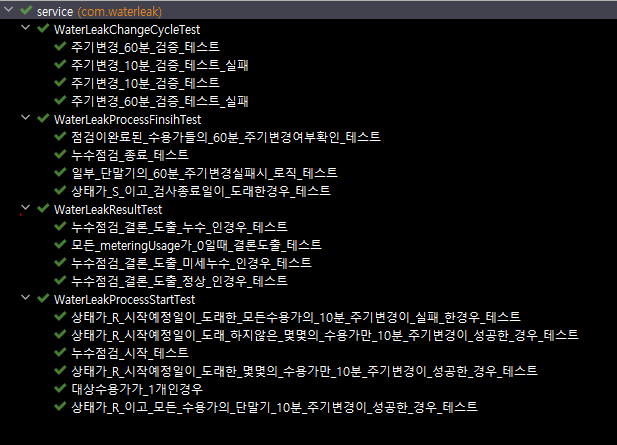

# NB 누수점검 관리

> **v0.0.1 [_중요!!프로젝트에 수정사항 발생시 현재 문서를 반드시 수정 및 수정내역 반영 할것!!_]**

관제시스템의 누수점검 기능을 통해 등록된 점검 대상 수용가에 대하여 누수점검을 진행하는 프로그램

## 1. 프로젝트 구조

---

### 1.1 프로젝트 구조

`com.waterleak.schedule` _WaterLeakSchedule_ 에 등록된 세 종류의 스케쥴러로 동작.

* start() [매시 00분 / 15분 / 30분 / 45분]
    * 예정된 누수점검 정보 조회

* finish() [매시 10분 / 25분 / 40분 / 55분]
    * 종료 예정인 점검정보 조회

* clean()  [매시 20분 / 35분 / 50분 / 05분]
    * 완료된 점검 중 주기변경이 6/60 으로 변경되지않은 수용가 조회 및 주기변경 커맨드 요청

### 1.2 DB 이중화

누수점검 프로젝트의 DB접속 정보는 2개로 나누어져 있다.

* `com.waterleak.dao.reporting`
    * 검침정보 저장을 위한 DB
* `com.waterleak.dao.wapi`
    * 관제시스템 DB

## 2. 프로젝트 구동

---

### 2.1 실행 명령어

* 운영 환경일 경우

> nohup java -jar /data/waterleak/waterLeak-0.0.1-SNAPSHOT.jar --spring.profiles.active=prod &

* 로컬 환경일 경우

> nohup java -jar /data/waterleak/waterLeak-0.0.1-SNAPSHOT.jar --spring.profiles.active=local &

* 개발 환경일 경우

> nohup java -jar /data/waterleak/waterLeak-0.0.1-SNAPSHOT.jar --spring.profiles.active=dev &

### 2.1 설정파일

`src/main/resources` 경로의 `application-*.yml` 파일을 수정.

## 3. 테스트

---
H2 DB를 활용하여 테스트 진행

* 테스트데이터 경로 `src/main/resources/data.sql`
    * 테스트코드에 필요한 초기화 데이터
* 테스트코드 경로 `test.com.waterleak`

## 4. 누수점검 프로세스

---

1. 사용자가 관제 시스템을 통해 대상 수용가 등록
2. 대상 단말기의 **15자리** imei값을 `reporting.ack_nbiot` 테이블에 insert
3. 단말기에 10분 주기변경 command 요청
4. 모든 단말기의 주기가 10분으로 변경되는 시점에 startDt, endDt 셋팅
5. endDt 도래후 주기변경 종료
6. `reporting.meterdataseoulnbiot` 테이블에 10분 단위로 쌓인 데이터를 기반으로 **누수 여부** 판별
7. 누수점검 판별 후 단말기에 60분 주기변경 command 요청 (원상태로 복원)
8. 60분으로 변경확인 후 최종 누수점검 종료

## 5. 누수점검 판별

---
> 10분 단위 검침 데이터에서 사용량이 0으로 출력된 경우에 따라 누수 여부 판별

* 사용량이 0인 경우가 0 ~ 3 : 누수
* 사용량이 0인 경우가 4 ~ 6 : 미세 누수
* 사용량이 0인 경우가 7 이상 : 정상

## 6. 주기변경 판별

---
> 단말기 주기 변경 후 현재 기준 최신 검침 데이터 10개 조회,  
> 검침 시간 간의 간격 차이 계산하여 판별

* 10개의 데이터를 각각 이전 시간과 비교하여 주기 변경 성공 5번 이상일 때 TRUE

## 수정내역
> 최신 내역을 상단에 기술할것

---

* 2022-12-19 [ kny3705 ] - 10분주기변경판별로직 추가
* 2022-12-19 [ yglee ]  - 최초 작성
